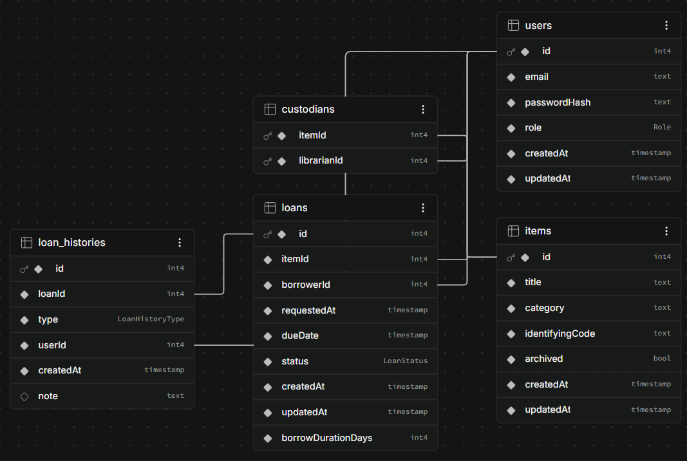

# Schema

Answer each of these, in your own words.

- Table by table: what columns and types does each one have?
- Which relationships are one-to-many, and which are many-to-many?
- Which constraints are enforced by the database, and which by application code — and why did you draw the line there?
- What did you deliberately denormalise?
- What would break first if this had 100x the data?

---

## 1. Table by table: what columns and types does each one have?

The database runs on PostgreSQL managed through Prisma.

### Enums

I defined three custom enum types in PostgreSQL to restrict categorical attributes at the database engine level:

- Role: LIBRARIAN, MEMBER
- LoanStatus: REQUESTED, ISSUED, RETURNED, LOST
- LoanHistoryType: REQUESTED, ISSUED, RETURNED, LOST

### users

Stores account credentials, profile details, and role assignments for staff and borrowers alike.

| Column | Prisma Type | Postgres Type | Nullable | Default | Constraints & Indexes | Description |
|---|---|---|---|---|---|---|
| id | Int | SERIAL (INTEGER) | No | Autoincrement | Primary Key (users_pkey) | Unique user identifier |
| email | String | TEXT | No | None | Unique (users_email_key) | Login email address |
| passwordHash | String | TEXT | No | None | None | Bcrypt password hash string |
| role | Role | Role enum | No | None | None | Access role (LIBRARIAN or MEMBER) |
| createdAt | DateTime | TIMESTAMP(3) | No | now() | None | Account creation timestamp |
| updatedAt | DateTime | TIMESTAMP(3) | No | auto-updated | None | Timestamp of last account change |

- Primary Key: id
- Unique Constraints: email
- Foreign Keys: None
- Indexes: B-tree on email (unique)

---

### items

Represents the physical equipment catalogue assets tracked by the library.

| Column | Prisma Type | Postgres Type | Nullable | Default | Constraints & Indexes | Description |
|---|---|---|---|---|---|---|
| id | Int | SERIAL (INTEGER) | No | Autoincrement | Primary Key (items_pkey) | Unique asset identifier |
| title | String | TEXT | No | None | None | Display title of the piece of equipment |
| category | String | TEXT | No | None | Index (items_category_idx) | Asset category (e.g. Cameras, Audio, Tools) |
| identifyingCode | String | TEXT | No | None | Unique (items_identifyingCode_key) | Asset inventory tag |
| archived | Boolean | BOOLEAN | No | false | Index (items_archived_idx) | Soft-delete flag hiding item from active views |
| createdAt | DateTime | TIMESTAMP(3) | No | now() | None | Catalogue entry creation timestamp |
| updatedAt | DateTime | TIMESTAMP(3) | No | auto-updated | None | Last metadata modification timestamp |

- Primary Key: id
- Unique Constraints: identifyingCode
- Foreign Keys: None
- Indexes:
  - B-tree on identifyingCode (unique)
  - B-tree on archived (filtering active vs archived items)
  - B-tree on category (filtering loans and items by category)

---

### loans

Tracks the borrowing lifecycle of an asset from initial request to return or loss.

| Column | Prisma Type | Postgres Type | Nullable | Default | Constraints & Indexes | Description |
|---|---|---|---|---|---|---|
| id | Int | SERIAL (INTEGER) | No | Autoincrement | Primary Key (loans_pkey) | Unique loan identifier |
| itemId | Int | INTEGER | No | None | Foreign key, Index | The catalogue item being borrowed |
| borrowerId | Int | INTEGER | No | None | Foreign key, Index | The member borrowing the item |
| borrowDurationDays | Int | INTEGER | No | 14 | None | Requested borrowing period (1 to 31 days) |
| requestedAt | DateTime | TIMESTAMP(3) | No | now() | Index (loans_requestedAt_idx) | Timestamp when the loan was requested |
| dueDate | DateTime | TIMESTAMP(3) | No | None | Index (loans_dueDate_idx) | Return due date (required for all loans) |
| status | LoanStatus | LoanStatus enum | No | REQUESTED | Index (loans_status_idx) | Current state (REQUESTED, ISSUED, RETURNED, LOST) |
| createdAt | DateTime | TIMESTAMP(3) | No | now() | None | Row insertion timestamp |
| updatedAt | DateTime | TIMESTAMP(3) | No | auto-updated | None | Row update timestamp |

- Primary Key: id
- Unique Constraints: None
- Foreign Keys:
  - itemId references items(id) on delete RESTRICT on update CASCADE
  - borrowerId references users(id) on delete RESTRICT on update CASCADE
- Indexes:
  - B-tree on itemId
  - B-tree on borrowerId
  - B-tree on status
  - B-tree on dueDate
  - B-tree on requestedAt
  - Composite B-tree on (status, dueDate) for overdue alert lookups

---

### loan_histories

An append-only audit trail capturing every state change, who performed it, and any notes left.

| Column | Prisma Type | Postgres Type | Nullable | Default | Constraints & Indexes | Description |
|---|---|---|---|---|---|---|
| id | Int | SERIAL (INTEGER) | No | Autoincrement | Primary Key (loan_histories_pkey) | Unique history entry identifier |
| loanId | Int | INTEGER | No | None | Foreign key, Index | The loan this action belongs to |
| type | LoanHistoryType | LoanHistoryType enum | No | None | None | Action taken (REQUESTED, ISSUED, RETURNED, LOST) |
| userId | Int | INTEGER | No | None | Foreign key, Index | The user (member or staff) who took action |
| createdAt | DateTime | TIMESTAMP(3) | No | now() | Index | Timestamp when the event took place |
| note | String? | TEXT | Yes | NULL | None | Optional note left by librarian or borrower |

- Primary Key: id
- Unique Constraints: None
- Foreign Keys:
  - loanId references loans(id) on delete RESTRICT on update CASCADE
  - userId references users(id) on delete RESTRICT on update CASCADE
- Indexes:
  - Composite B-tree on (loanId, createdAt) for loading chronological loan timelines
  - B-tree on userId

---

### custodians

A dedicated join table linking librarians to the catalogue assets they manage.

| Column | Prisma Type | Postgres Type | Nullable | Default | Constraints & Indexes | Description |
|---|---|---|---|---|---|---|
| itemId | Int | INTEGER | No | None | Foreign key, Composite PK | The catalogue item |
| librarianId | Int | INTEGER | No | None | Foreign key, Composite PK, Index | The librarian assigned as custodian |

- Primary Key: Composite on (itemId, librarianId)
- Unique Constraints: Enforced by the composite primary key
- Foreign Keys:
  - itemId references items(id) on delete CASCADE on update CASCADE
  - librarianId references users(id) on delete CASCADE on update CASCADE
- Indexes:
  - B-tree on librarianId
  - Composite index on (itemId, librarianId) via primary key

### Supabase Schema Visualizer



---

## 2. Which relationships are one-to-many, and which are many-to-many?

### One-to-Many Relationships (1:N)

1. users to loans (1:N)
   A single member user can borrow multiple items over time. Each loan row has a single borrowerId pointing to that member. Deleting a user who has active or historical loans is blocked by RESTRICT so historical records are not orphaned.

2. items to loans (1:N)
   A single piece of equipment can be borrowed repeatedly over its lifetime. Each loan row points to exactly one itemId. Deleting an item that has past loans is also blocked by RESTRICT to preserve checkout history.

3. loans to loan_histories (1:N)
   Every loan has a chronological timeline of events (requested, issued, returned, or marked lost). Each event points to its parent loanId. Because the history is an audit trail, loans with history entries cannot be casually dropped.

4. users to loan_histories (1:N)
   A user (whether a member requesting or a librarian checking out or returning gear) acts as the author of an audit record. Each history entry stores the acting userId.

### Many-to-Many Relationships (M:N)

1. items to users (Librarians) via custodians (M:N)
   Any item can have multiple librarians looking after it, and any librarian can be the custodian for multiple items.
   I modeled this using an explicit join table, custodians. Rather than hiding the join table behind an implicit Prisma relation, having the explicit Custodian model gives us:
   - A composite primary key on (itemId, librarianId) that naturally prevents adding the same custodian twice.
   - Foreign keys configured with CASCADE on both sides, so when an item is deleted or a librarian account is removed, the junction rows clean themselves up automatically without needing manual cleanup code.

---

## 3. Which constraints are enforced by the database, and which by application code — and why did you draw the line there?

### Enforced by the Database

I relied on PostgreSQL and Prisma schema rules for fundamental data shapes, structural relationships, and relational guarantees:

1. Uniqueness: Email addresses in the users table and identifying codes in the items table are enforced by unique B-tree indexes. The database guarantees two users cannot register with the same email and two cameras cannot share an inventory tag.
2. Composite Primary Key on Junction Table: The custodians table uses (itemId, librarianId) as its composite primary key, preventing duplicate custodian assignments.
3. Domain Typing: The enums (Role, LoanStatus, LoanHistoryType) ensure that unexpected status strings can never be inserted into the database.
4. Non-nullability: Every critical column (including dueDate after the recent migration, borrowDurationDays, status, timestamps, and foreign keys) is set to NOT NULL. Only loan_histories.note is nullable.
5. Referential Integrity: Foreign keys prevent creating loans for non-existent items or users. RESTRICT rules on loans and history rows prevent accidental cascades that would erase checkout histories, while CASCADE on custodians ensures join rows drop cleanly.

### Enforced by Application Code

Dynamic business policies, multi-row validations, temporal arithmetic, and role authorization live in backend controllers:

1. Only One Open Loan per Item:
   While an item is in REQUESTED or ISSUED status, nobody else can request or borrow it. I enforce this inside an atomic Prisma transaction by locking the target item row with SELECT FOR UPDATE and checking for existing open loans before creating a new one.
   Why application code? Relational databases do not easily support conditional uniqueness across a subset of rows without database-specific partial indexes (like a unique index where status in REQUESTED, ISSUED). Handling this in the application transaction gives us full control over user-facing error messages, telling the user specifically what status the conflicting loan has and what item was blocked.
2. Member Borrowing Limit (Maximum 2 Active Items):
   Members are allowed at most 2 active loans (REQUESTED or ISSUED combined). Returned and lost items do not count. In the loan request flow, the server serializes requests per user using SELECT id FROM users WHERE id = borrowerId FOR UPDATE, counts their active loans, and rejects with HTTP 409 Conflict if they are already at 2.
   Why application code? Aggregate constraints across multiple rows cannot be enforced with simple table check constraints or column unique constraints. Placing row-level locking and counting inside the controller keeps the business rule visible, testable, and concurrency-safe.
3. Role Verification:
   The database users table holds both members and librarians. The database foreign key on loans.borrowerId only verifies that the ID exists in users, not what role they hold. The application verifies that a borrower has the MEMBER role, and that an assigned custodian has the LIBRARIAN role.
4. State Machine Transitions:
   Valid loan transitions are strictly:
   - REQUESTED to ISSUED
   - ISSUED to RETURNED
   - ISSUED to LOST
   Terminal states (RETURNED and LOST) cannot be modified. The controllers validate that the loan is in the expected status before executing updates, returning 409 Conflict if an illegal transition is attempted.
5. Due Date Rules:
   The due date must be strictly after the issue date, cannot be the same calendar day, and cannot be more than one month into the future. Because calendar month math (handling 28, 30, and 31-day months in UTC) is nuanced, this is implemented in date utility functions rather than an inflexible SQL check expression.
6. Borrow Duration Bounds:
   When requesting an item, the member must select a duration between 1 and 31 days. This integer check is handled upon request validation.
7. Audit Trail Immutability:
   The application intentionally exposes no PUT, PATCH, or DELETE routes for loan_histories. Once written inside a state transition transaction, an audit row cannot be changed or deleted through the API.

### Enforced only in the UI

Client-side checks exist purely for snappy user experience:
- Restricting HTML date pickers to allowed min and max dates.
- Validating the 1 to 31 day numeric input before submit.
- Disabling buttons for unavailable items or completed loans.

Every one of these checks is authoritatively re-checked on the backend. The UI is never trusted with business rules.

---

## 4. What did you deliberately denormalise?

### Strict Third Normal Form (3NF)

I chose not to denormalise stored data in this schema. The database is kept in strict Third Normal Form:

- No Stored Item Availability: There is no isAvailable column on the items table. An item's availability is computed dynamically based on whether it currently has any open loans with status REQUESTED, ISSUED, or LOST.
- No Stored Overdue Flag: There is no isOverdue boolean column or OVERDUE enum value in LoanStatus. A loan is considered overdue whenever status is ISSUED and dueDate is earlier than the current timestamp.
- No Cached Counter Columns: Neither users nor items stores counter columns like totalLoansCount or activeItemsCount. All dashboard stats, member borrowing limits, and availability badges query source-of-truth rows.
- No Snapshot Strings: The loans table only references itemId and borrowerId. It does not duplicate the item title, item category, or borrower email.

### Trade-offs

- Advantages: Zero chance of state drift. If a loan is returned or marked lost, the item becomes available immediately without needing multi-table synchronization or background cleanup jobs. Changing a user's email or item title updates in one place and reflects everywhere.
- Costs: Queries that need availability or dashboard metrics perform JOINs and COUNT queries. At our current scale, indexed queries on PostgreSQL run in under a couple of milliseconds, making normalized reads fast and write operations straightforward.

### Functional Separation: borrowDurationDays vs dueDate

The loans table holds both borrowDurationDays (integer, default 14) and dueDate (timestamp). This is deliberate separation rather than denormalisation:
- borrowDurationDays records what the member asked for (e.g. 7 days or 21 days).
- dueDate is the actual operational deadline set when equipment is handed over. If a librarian issues an item a week after the initial request or grants a custom extension, storing both preserves the original request intent alongside the binding checkout deadline.

---

## 5. What would break first if this had 100x the data?

If the dataset grew 100x (say 10,000 catalogue items, 20,000 users, 100,000 loans, and 500,000 loan history entries), five clear bottlenecks would surface based on the actual queries in this repository:

### 1. Unindexed 8-Week Dashboard Return Query on loan_histories

In dashboardController.js, the 8-week return chart queries:
```javascript
prisma.loanHistory.findMany({
  where: {
    type: LoanHistoryType.RETURNED,
    createdAt: { gte: oldestWeekStart }
  }
})
```
In schema.prisma, loan_histories only has indexes on (loanId, createdAt) and on (userId). There is no index on type, nor on (type, createdAt).
At 100x scale, PostgreSQL would have to perform a sequential full table scan across half a million history records on every single dashboard view just to find the recent returns. Adding a composite B-tree index on (type, createdAt) in loan_histories would solve this immediately.

### 2. Unbounded Item Listing in GET /api/items

In itemController.js, the main catalogue endpoint runs findMany without pagination. It eager-loads all items along with their custodians and every historical loan status just to compute whether each item is available in JavaScript.
At 10,000 items with 100,000 loans, loading the whole dataset into Node memory on every catalogue visit would cause huge JSON payloads, memory bloat in the Node process, and browser lag.
The fix is adding server-side pagination (limit and offset or cursor) to GET /api/items and computing availability directly in SQL using an EXISTS subquery on open loans rather than loading full loan histories into memory.

### 3. Leading-Wildcard Text Search in GET /api/loans

In loanController.js, searching loans uses contains with mode insensitive on item title, identifying code, and borrower email. Prisma turns this into PostgreSQL ILIKE with wildcards on both ends (%search%).
Standard B-tree indexes cannot accelerate leading wildcards. Searching across 100,000 loans forces full table scans across loans joined with items and users.
To handle this at scale, we would need PostgreSQL trigram indexes (using the pg_trgm extension with GIN indexes on title, code, and email) or dedicated full-text search columns.

### 4. In-Memory CSV Export

In loanController.js, exportLoansCsv fetches all matching loans and their relations into a single JavaScript array in memory before running csv-stringify synchronously.
Exporting tens of thousands of rows this way would quickly exceed Node's default heap limit and crash the server with an out-of-memory error. Streaming the rows from PostgreSQL using a database cursor directly into the HTTP response stream is the proper solution for high volumes.

### 5. Offset Pagination Slowness

The loans list uses skip: (page - 1) * pageSize. At page 500 (skipping 10,000 rows), PostgreSQL must read and discard all 10,000 prior rows before returning 20.
Switching to keyset (cursor-based) pagination using (requestedAt, id) would keep page-turn latency constant regardless of how deep into the list a librarian navigates.
